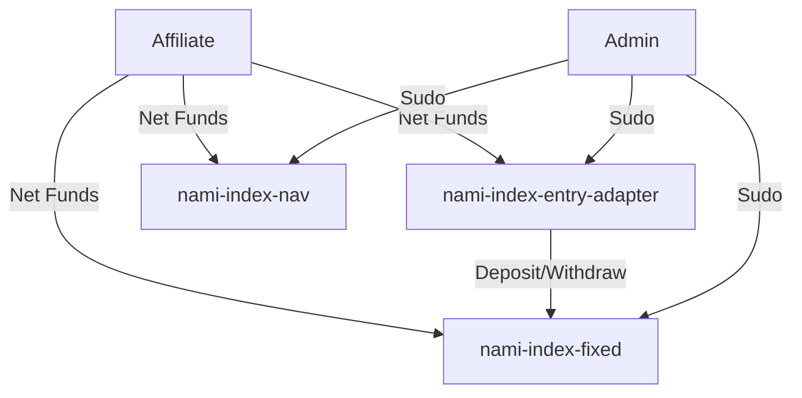

# Nami Index

## Overview
Nami Index is a suite of CosmWasm smart contracts for managing tokenized index funds. It supports two strategies: `nami-index-fixed` (fixed-unit index, with receipt tokens representing a deterministic asset basket) and `nami-index-nav` (NAV-based index, with tokens reflecting proportional fund value). The system includes `nami-index-entry-adapter` for token swaps and `nami-affiliate` for affiliate fee distribution. It integrates with `Rujira TokenFactory` for receipt tokens, `rujira_rs::fin` for swaps, and `Layer1Asset` oracles for NAV pricing.

### Contracts

#### nami-index-fixed
Manages a fixed-unit index strategy.
- **Key Features**:
    - Deposits require exact-ratio funds (`ExecuteMsg::Deposit`).
    - Withdrawals are proportional to receipt tokens (`ExecuteMsg::Withdraw`).
    - Admin/multisig-triggered reallocation via `SudoMsg::Reallocate` uses two-leg swaps.
    - Fees: AUM (annualized) and exit fees via `FeeManager`.
- **Implementation**:
    - `Vault` validates deposits (`Vault::deposit`), calculates withdrawals (`Vault::withdraw`), and rebalances weights (`Vault::rebalance`).
    - Stores allocations as `(denom, (weight, swap_contract))`.
    - Uses `rujira_rs::fin` swaps, validated for `quote_denom`.
- **Interface**: `nami-rs::interfaces::index_fixed`.
- **Use Case**: Fixed asset basket with predictable composition.

#### nami-index-nav
Manages a NAV-based index strategy.
- **Key Features**:
    - Deposits and withdrawals in `quote_denom` (e.g., USDC) via `ExecuteMsg::Deposit` and `ExecuteMsg::Withdraw`.
    - Permissionless rebalancing via `ExecuteMsg::Run`, using `Layer1Asset` oracle prices.
    - Withdrawals swap to `quote_denom` with slippage tolerance.
    - Fees: AUM and exit fees via `FeeManager`.
- **Implementation**:
    - `Vault` calculates NAV (`Vault::nav`) and rebalances within thresholds (`Vault::rebalance`).
    - Stores `AssetAllocation` (denom, weight, swap contract, oracle, threshold).
    - Validates swap contracts for `quote_denom`.
- **Interface**: `nami-rs::interfaces::index_nav`.
- **Use Case**: Flexible transactions in a stable denomination.

#### nami-index-entry-adapter
Facilitates `nami-index-fixed` interactions via swaps.
- **Key Features**:
    - Converts `quote_denom` to `nami-index-fixed` allocation (`ExecuteMsg::Deposit`).
    - Withdraws and swaps to `quote_denom` (`ExecuteMsg::Withdraw`).
    - Admin/multisig manages swap contracts via `SudoMsg::AddSwapContract` and `RemoveSwapContract`.
- **Implementation**:
    - `Index` queries `nami-index-fixed` status (`VaultStatusResponse`) for allocation and receipt token denom (`x/nami-index-<address>-rcpt`).
    - Generates deposit (`Index::deposit_msg`) and withdrawal (`Index::withdraw_msg`) messages.
    - Executes `rujira_rs::fin` swaps, returning residuals via `BankMsg::Send`.
- **Interface**: `nami-rs::interfaces::index_entry_adapter`.
- **Use Case**: Simplifies `nami-index-fixed` interactions.

#### nami-affiliate
Distributes affiliate fees.
- **Key Features**:
    - Deducts fees (up to 10,000 bps) and sends to affiliate address (`ExecuteMsg::Execute`).
    - Forwards net funds to target contracts.
    - Returns residuals via `ExecuteMsg::Send`.
- **Implementation**:
    - Validates funds and fee rates.
    - Emits `nami-affiliate-execute` event.
    - No `sudo` operations.
- **Interface**: `nami-rs::interfaces::affiliate`.
- **Use Case**: Third-party fee-earning integrations.

### System Architecture
- **Core Indices**: `nami-index-fixed` and `nami-index-nav`, defined in `nami-rs::interfaces`.
- **Adapter**: `nami-index-entry-adapter` abstracts swap logic for `nami-index-fixed`.
- **Affiliate**: `nami-affiliate` adds fee distribution.

### Key Interactions
1. **Deposits**:
    - **Via `nami-affiliate`**: Deducts fees, forwards to `Adapter`, `Fixed`, or `NAV`.
    - **Via `nami-index-entry-adapter`**: Swaps `quote_denom`, deposits via `Index::deposit_msg`, returns residuals.
    - **Direct**: `nami-index-fixed` (exact ratio), `nami-index-nav` (quote denom).
2. **Withdrawals**:
    - **Via `nami-index-entry-adapter`**: Burns tokens, withdraws via `Index::withdraw_msg`, swaps to `quote_denom`.
    - **nami-index-nav**: Burns tokens, swaps to `quote_denom` with slippage.
3. **Rebalancing**:
    - `nami-index-fixed`: Admin/multisig-triggered reallocation via two-leg swaps.
    - `nami-index-nav`: Permissionless rebalancing via `Run`.
4. **Fees**:
    - AUM: Minted to fee collector (`FeeManager::aum_fee`).
    - Exit: Deducted on withdrawals (`FeeManager::tx_fee`).
    - Affiliate: Deducted by `nami-affiliate`.

